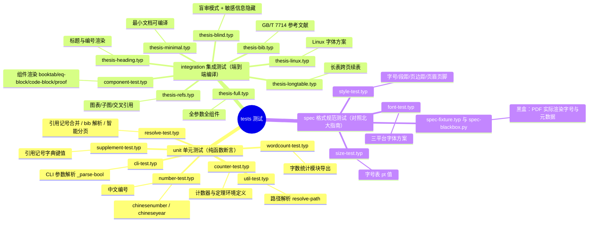

# 测试结构说明

本目录的测试按职责分为三类，由 `just test` 统一运行（也可分别运行 `just unit` / `just integration` / `just spec`）。

```text
tests/
├── unit/          单元测试 —— 纯函数，无渲染，断言返回值
├── integration/   集成测试 —— 端到端编译真实文档，验证渲染结果
└── spec/          格式规范测试 —— 对照《北大研究生学位论文写作指南》校验格式
```

## 思维导图



## 目录树

```text
tests/
├── unit/                      单元测试（纯函数）
│   ├── number-test.typ
│   ├── util-test.typ
│   ├── cli-test.typ
│   ├── resolve-test.typ
│   ├── counter-test.typ
│   ├── supplement-test.typ
│   └── wordcount-test.typ
├── integration/               集成测试（端到端编译）
│   ├── component-test.typ
│   ├── thesis-minimal.typ
│   ├── thesis-linux.typ
│   ├── thesis-full.typ
│   ├── thesis-blind.typ
│   ├── thesis-heading.typ
│   ├── thesis-refs.typ
│   ├── thesis-longtable.typ
│   └── thesis-bib.typ
└── spec/                      格式规范测试（对照指南）
    ├── size-test.typ
    ├── font-test.typ
    ├── style-test.typ
    └── spec-fixture.typ        （黑盒样张，配合 scripts/spec-blackbox.py）

scripts/                       测试驱动脚本
├── unit-tests.sh
├── integration-tests.sh
├── spec-tests.sh
└── spec-blackbox.py
```

---

## 单元测试（`tests/unit/`）

纯函数，无页面渲染，直接 `#assert.eq` 断言返回值。编译失败即退出码非零。

| 文件 | 测试内容 | 测试要点 |
|------|---------|---------|
| `number-test.typ` | 中文编号 | `chinesenumber` 数字转中文（1→一、10→十、2026→二千零二十六）；`chineseyear` 年份转中文（2026→二〇二六、2000→二〇〇〇） |
| `util-test.typ` | 路径解析 | `resolve-path`：`path` 类型原样返回；字符串 `"ref.bib"` → `"../ref.bib"` |
| `cli-test.typ` | CLI 参数解析 | `_parse-bool`：`"true"`/`"1"`→true、`"false"`/`"0"`→false、`none`→默认值、非法值→回退默认 |
| `resolve-test.typ` | 解析函数 | `resolve-supplements` 合并/覆盖引用记号；`resolve-bib(none)`→none；`make-smartpagebreak` 返回闭包 |
| `counter-test.typ` | 计数器定义 | part/chapter/image/table/raw/equation 计数器存在；9 种定理计数器存在；`theorem-kinds` 含 8 种；`skippedstate` 存在 |
| `supplement-test.typ` | 引用记号字典 | 图/表/公式/代码/节/图表 及 插图/表格/公式/代码列表、符号表、成果表 的键值正确 |
| `wordcount-test.typ` | 字数统计 | `word-count-cjk`/`total-words`/`total-characters` 导出非 none |

## 集成测试（`tests/integration/`）

端到端编译真实文档，验证各组件/页面能正确渲染。部分结果通过 `pdftotext` 检查 PDF 文本。

| 文件 | 测试内容 | 测试要点 |
|------|---------|---------|
| `component-test.typ` | 组件渲染 | `booktab` 三线表、`eq-block` 公式块、`code-block` 代码块、`proof` 证明 均可编译渲染 |
| `thesis-minimal.typ` | 最小文档 | `config()` 默认参数 + 封面即可编译 |
| `thesis-linux.typ` | Linux 字体 | `system: "linux"` 方案可编译 |
| `thesis-full.typ` | 全参数全组件 | 封面/书脊/版权/中英摘要/目录/插图·表格·公式·代码列表/符号表/正文/图/三线表/交叉引用/9 种定理/proof/代码块/公式块/附录/成果/致谢/声明 |
| `thesis-blind.typ` | 盲审模式 | `blind: true` 编译；PDF 中不得出现「张三/李四/23000xxxxx/Supervised by/Si Li/发表论文」 |
| `thesis-heading.typ` | 标题编号 | `=`（章）、`==`（节）标题渲染与中文章节编号 |
| `thesis-refs.typ` | 交叉引用 | `#figure`/`booktab`/`subfigure` 的 `@fig`/`@tbl`/`@fig-sub` 引用 |
| `thesis-longtable.typ` | 长表续表 | 60 行 `booktab` 强制跨页，验证"续表"标记渲染 |
| `thesis-bib.typ` | 参考文献 | `bib-file` + `@wang2010guide`/`@kopka2004guide` 引用，验证 GB/T 7714 中英文条目渲染 |

## 格式规范测试（`tests/spec/`）

以《北京大学研究生学位论文写作指南》(2014) 为蓝本，校验格式值与实际渲染。

**白盒**（断言 `build()` 样式字典值）：

| 文件 | 测试内容 | 测试要点 |
|------|---------|---------|
| `size-test.typ` | 字号表 | 三号 16pt、四号 14pt、小四 12pt、五号 10.5pt、小五 9pt |
| `font-test.typ` | 字体方案 | windows/macos/linux 三平台均含 5 类核心字体；Linux 黑体含 Noto Sans CJK SC、楷体含 AR PL UKai |
| `style-test.typ` | 样式字典 | 封面(小初36/一号26/二号22/三号16)、中文摘要(三号16、段前24后18)、英文摘要(16/24/18/行距12.5)、目录(小四12、段前6)、标题 4 级(16/14/13/12 + 段距 24/18、24/6、12/6)、正文(小四12、缩进2em、行距10.5)、脚注(小五9、悬挂1.5em)、图表(11pt)、参考文献(五号10.5、悬挂1.66em)、页边距(上3.0/下2.5/左2.6/右2.6cm)、页眉(五号10.5、距顶2cm、下划线0.75pt)、页码(五号10.5、距底1.75cm) |

**黑盒**（编译样张，用 pdfplumber 检查 PDF 实际渲染）：

| 文件 | 测试内容 | 测试要点 |
|------|---------|---------|
| `spec-fixture.typ` | 黑盒样张 | 渲染封面、章/节/二级标题、正文、脚注、图题、表题、页码，供检查脚本定位 |
| `spec-blackbox.py` | PDF 检查 | A4 页面尺寸；9 项字号实际渲染；页码 10.5pt（非 9pt）；PDF 元数据（普通版 Title/Author 非空，盲审版 Author 为空） |

---

## 运行方式

```bash
just test           # 全部：单元 + 集成 + 格式规范
just unit           # 仅单元测试
just integration    # 仅集成测试
just spec           # 仅格式规范测试
```

> 说明：
> - 单元/集成/格式规范测试编译产生的 `*.pdf` 已被 `.gitignore`（`tests/**/*.pdf`）忽略。
> - 集成测试的盲审验证用 `pdftotext` 而非 `strings`——Typst 的 PDF 内容流是 Flate 压缩的，`strings` 提取不出文本会导致假阴性。
> - 格式规范黑盒检查依赖 `pdfplumber`（`pip install pdfplumber`）。
